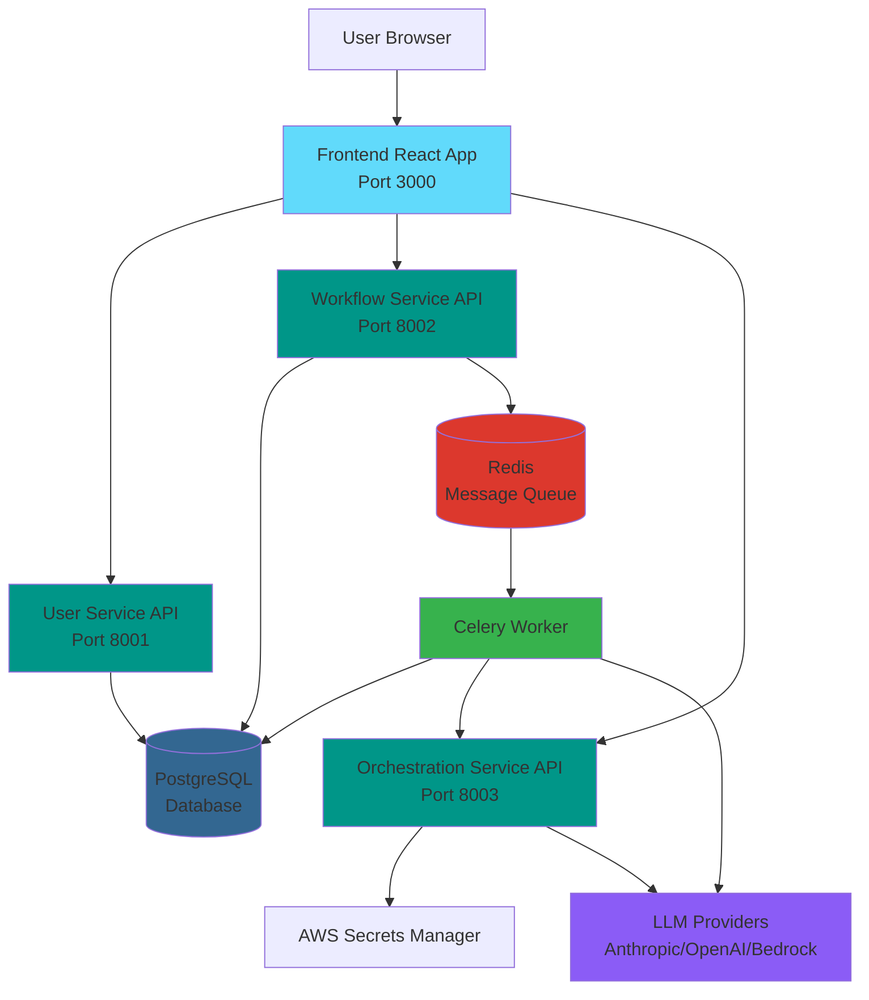
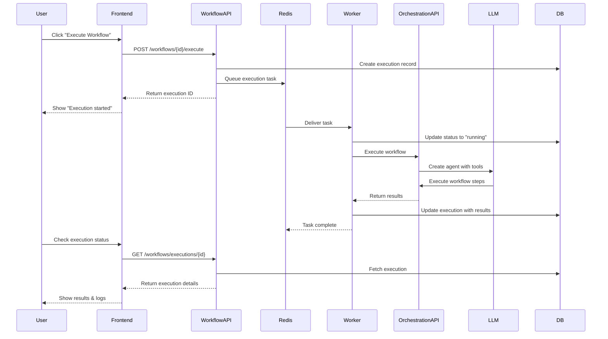
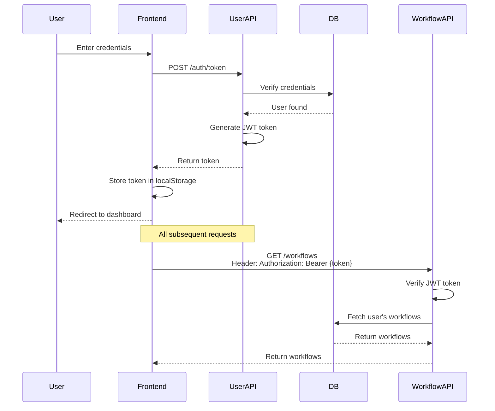
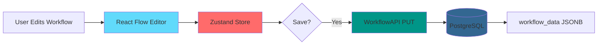
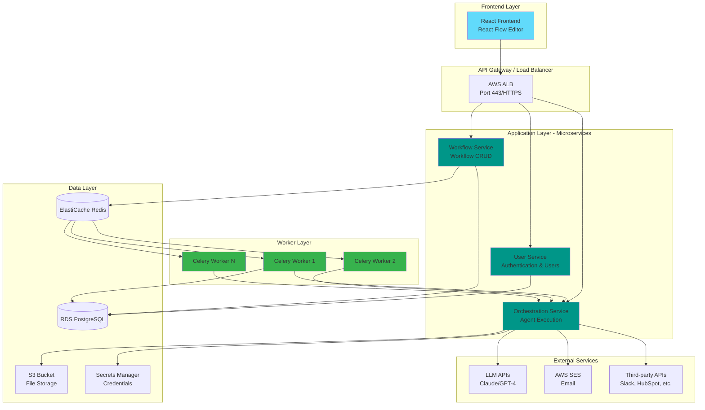
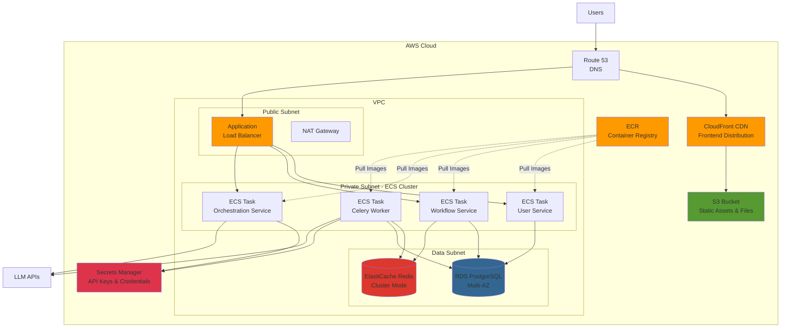
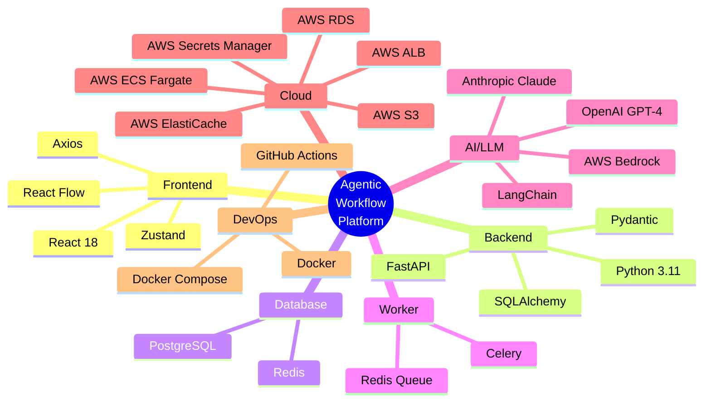

# Architecture Diagrams

## High-Level System Architecture

## Request Flow - Workflow Execution

## Component Interaction - Authentication Flow

## Data Flow - Workflow Editor

## Microservices Architecture

## Deployment Architecture (AWS)

## Technology Stack

## Key Design Patterns

### Microservices Pattern
- Each service has a single responsibility
- Services communicate via REST APIs
- Independent deployment and scaling
- Service isolation via Docker containers

### CQRS (Command Query Responsibility Segregation)
- Workflow execution (command) separated from status queries
- Commands go through message queue (Redis)
- Queries directly hit database

### Event-Driven Architecture
- Workflow execution is asynchronous
- Events published to Redis queue
- Workers consume events and process workflows
- Results stored in database for querying

### Repository Pattern
- Business logic separated from data access
- Service layer handles business rules
- Models define data structure
- Clear separation of concerns
